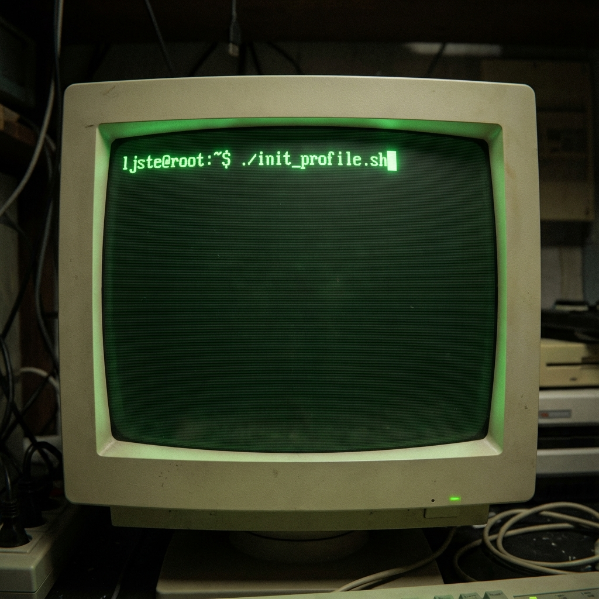

<div align="center">
  
</div>

<br />

```json
{
  "user": "Lucas Steinmeier",
  "role": "Computer Science & Cybersecurity Student",
  "university": "Villanova University",
  "status": "Building secure & scalable systems",
  "current_focus": "Full Stack Development"
}
```

<br />

### ~/skills

- **Frontend**: `Next.js` `React` `TypeScript` `TailwindCSS`
- **Backend**: `Go` `Node.js` `PostgreSQL` `Python`
- **DevOps**: `Docker` `Linux` `Git` `AWS`

<br />

### ~/projects

| Project | Stack | Description |
| :--- | :--- | :--- |
| **3D Portfolio** | `Three.js` `React` | Interactive 3D personal website |
| **Backend API** | `Go` `Postgres` | High-performance RESTful service |

<br />

### ~/stats

<p align="left">
  
  
</p>

<br />

```bash
# Contact
email="lsteinme@villanova.edu"
linkedin="linkedin.com/in/lsteinm"
instagram="@ljstein99"
```
